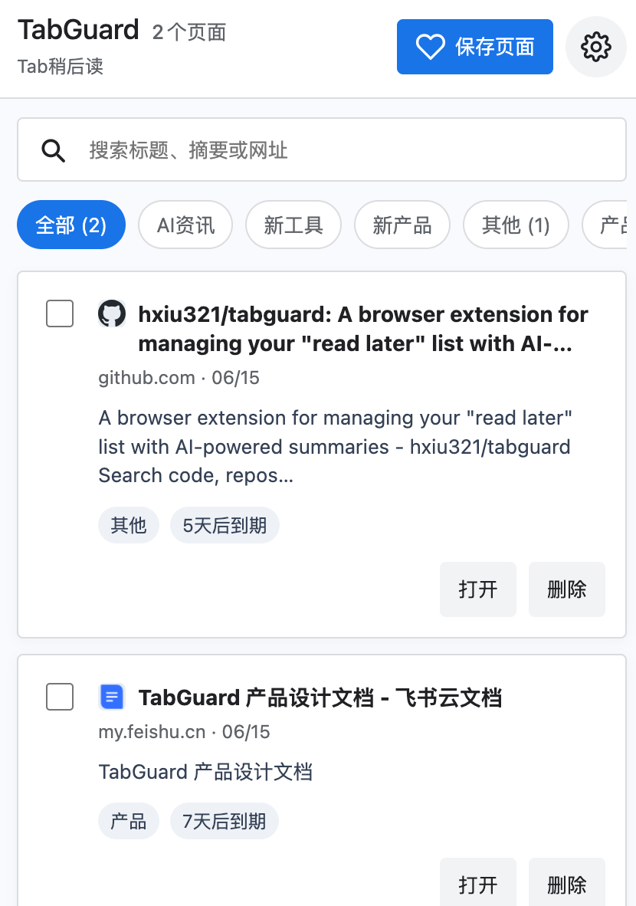
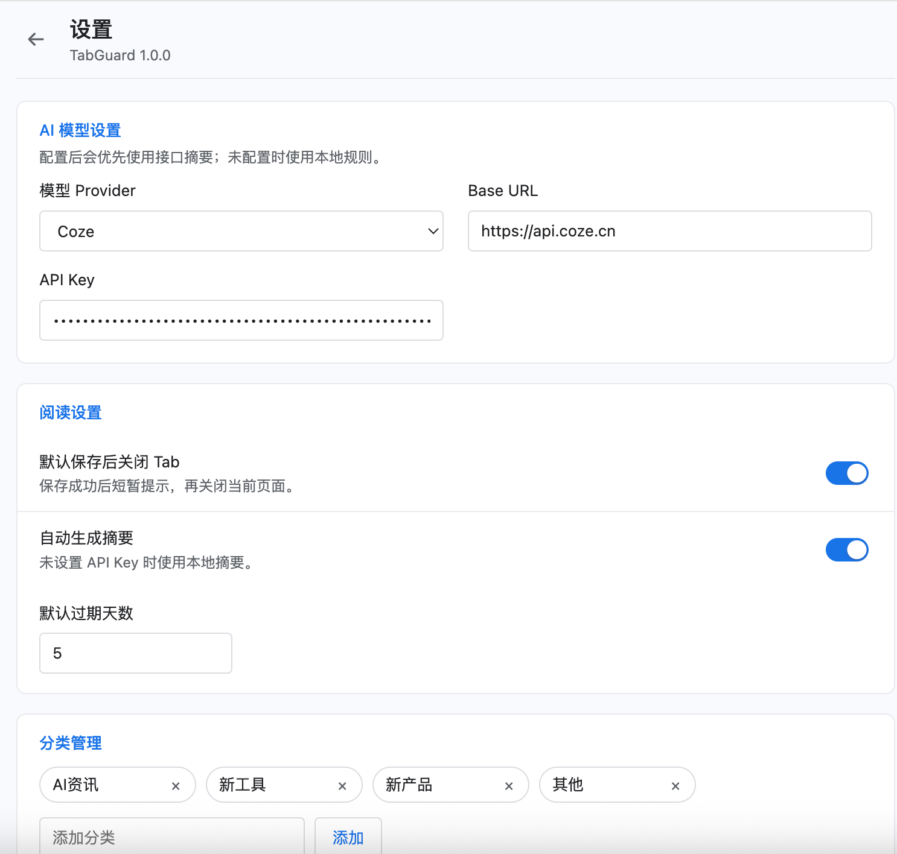

# TabGuard 🛡️

> 一个帮你"读完该读的，忘掉该忘的"的浏览器插件。一键保存页面，AI自动摘要，再也不用担心 Tab 太多。

---

## ✨ 功能

- 📥 **一键保存**：点击插件图标，保存当前页面，自动关闭 Tab
- 📝 **AI 摘要**：自动生成一句话摘要，快速判断是否有价值
- 🏷️ **智能分类**：自动归类（新闻/工作/产品/教程），方便检索
- ✅ **打开即已读**：点击"打开"后页面自动从清单移除，清单永远干净
- ⏰ **过期管理**：查看过期页面，删除或重置过期时间
- ⚙️ **可配置**：支持自定义 AI 模型、API Key、过期天数等

---

## 📸 截图

### 保存页面


### 设置页面


---

## 🚀 安装

### 方式一：Chrome Web Store（推荐）

1. 打开 [Chrome Web Store](https://chrome.google.com/webstore) 搜索 "TabGuard"
2. 点击"添加到 Chrome"

### 方式二：手动安装

1. 前往 [Releases](https://github.com/hxiu321/tabguard/releases) 下载最新版本的 `.zip` 文件
2. 解压文件
3. 打开 Chrome，访问 `chrome://extensions/`
4. 开启右上角的"开发者模式"
5. 点击"加载已解压的扩展程序"，选择解压后的文件夹

---

## 🛠️ 开发

### 环境要求

- Chrome 浏览器（推荐最新版）
- 文本编辑器（VS Code 推荐配置 Manifest V3 支持）

### 开发步骤

```bash
# 1. 克隆仓库
git clone https://github.com/hxiu321/tabguard.git
cd tabguard

# 2. 打开项目
# 用 VS Code 或其他编辑器打开

# 3. 修改代码

# 4. 重新加载插件
# Chrome → 扩展程序 → 点击 TabGuard 的刷新按钮 🔄
```

### 项目结构

```
tabguard/
├── manifest.json              # 插件配置（Manifest V3）
├── background.js              # 后台服务（保存、清理逻辑）
├── popup.html                 # Dashboard 页面
├── popup.js                   # Dashboard 交互逻辑
├── popup.css                  # 样式
├── settings.html              # 设置页面
├── settings.js                # 设置交互
├── settings.css
├── icons/                     # 插件图标
│   ├── icon16.png
│   ├── icon48.png
│   └── icon128.png
├── lib/                       # 工具库
│   ├── storage.js             # IndexedDB 封装
│   ├── ai.js                  # AI API 调用
│   └── utils.js               # 工具函数
├── assets/                    # 资源文件（截图等）
│   ├── screenshot-dashboard.png
│   ├── screenshot-save.png
│   └── screenshot-settings.png
├── LICENSE                    # MIT 许可证
├── README.md                  # 项目说明
└── .gitignore                 # Git 忽略文件
```

---

## 📝 配置

首次使用需要配置 AI 模型：

1. 点击插件图标打开 Dashboard
2. 点击右上角"设置"（⚙️）
3. 填写 AI 模型配置：
   - **模型 Provider**：选择 Coze 或其他
   - **Base URL**：`https://api.coze.cn`（Coze 国内）或 `https://api.coze.com`（Coze 国际）
   - **API Key**：从 Coze 平台获取
4. 保存配置

> 💡 **提示**：所有数据都存储在本地浏览器，不会上传到服务器，隐私安全。

---

## 🎨 设计风格

- **风格**：Chrome 系统原生风格
- **色调**：蓝色（#2563EB）为主，白色为辅
- **交互**：简洁、不打扰、工具感强

---

## 🔧 技术栈

- **平台**：Chrome Extension (Manifest V3)
- **前端**：纯 HTML + CSS + JavaScript（无框架）
- **存储**：IndexedDB（本地存储，容量大）
- **AI 服务**：Coze API（可切换其他模型）

---

## 📊 架构

```
[网页] → 点击插件 → 获取 URL/标题
    → 调用 AI 摘要 API → 生成摘要 + 分类
    → 存入 IndexedDB → 关闭 Tab

[Dashboard] → 读取 IndexedDB → 按分类展示
    → 用户点击"打开" → 新 Tab 打开原页面
    → 从清单移除
```

---

## 🤝 贡献

欢迎提交 Issue 和 Pull Request！

### 贡献指南

1. Fork 本仓库
2. 创建特性分支 (`git checkout -b feature/AmazingFeature`)
3. 提交更改 (`git commit -m 'Add some AmazingFeature'`)
4. 推送到分支 (`git push origin feature/AmazingFeature`)
5. 开启 Pull Request

详见 [CONTRIBUTING.md](CONTRIBUTING.md)

---

## 📄 许可证

本项目采用 [MIT License](LICENSE) 开源协议。

---

## 🙏 致谢

- [Coze](https://www.coze.cn) - AI 模型服务
- Chrome Extension 社区 - 技术支持

---

## 🔗 相关链接

- [产品设计文档](https://www.feishu.cn/docx/Lj0AdvJMDoHqJsxrMi2ceDhtndf)
- [Chrome 扩展开发文档](https://developer.chrome.com/docs/extensions/)
- [Coze API 文档](https://www.coze.cn/docs/developer_guides/chat)

---

## 📞 联系方式

- Issues：[GitHub Issues](https://github.com/hxiu321/tabguard/issues)
- Email：hxiu321@gmail.com

---

## ⭐ Star History

如果这个项目对你有帮助，请给个 Star ⭐️

[](https://star-history.com/#your-username/tabguard&Date)# tabguard
